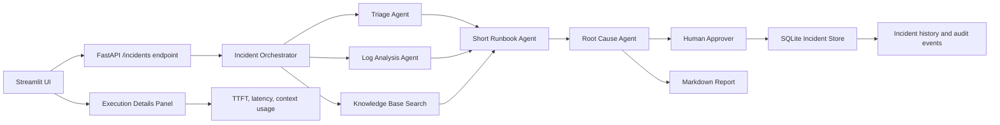

# AI-Powered Incident Response Copilot for Triage, Runbook Generation, and Human-in-the-Loop Approval

## 1. Executive Summary
This project presents an AI-assisted incident response system designed to accelerate the early stages of incident investigation while preserving operational safety. A user submits an incident title, description, and supporting logs, and the system triages the issue, identifies likely failure patterns, retrieves relevant runbook context, generates a concise incident-specific action plan, and proposes a probable root cause before a human approval step is required. The solution is tailored for IT operations teams, support engineers, and developers who need a structured first-pass analysis in time-constrained operational scenarios. The core architectural insight is that a multi-agent workflow produces more reliable and reviewable outputs than a monolithic prompt because each agent specializes in a distinct function, including triage, log analysis, knowledge grounding, and root-cause synthesis. A second key design principle is the use of a lightweight knowledge base to constrain the model to relevant operational guidance, improving contextual relevance and reducing hallucination risk. The final design choice is human-in-the-loop approval, which ensures that the system supports decision-making without executing remediation automatically.

## 2. Problem and Users
Modern incident response typically begins with incomplete, noisy, and partially structured information. Engineers commonly receive alerts, log snippets, and narrative descriptions, yet still have to perform the manual steps of triage, log review, runbook lookup, and root-cause narrowing before actionable decisions can be made. This process is slow, inconsistent across responders, and often dependent on prior operational knowledge. The project addresses this challenge by translating a raw incident description into a structured workflow that produces a triage summary, log-analysis view, relevant runbook guidance, and a root-cause recommendation. The primary users are IT operations teams, support engineers, site reliability engineers, and developers responsible for production systems and service recovery. The application is designed to support a rapid first-pass investigation before escalation to deeper technical diagnostics or broader response processes. A simple script would not be sufficient because the workflow requires contextual reasoning, specialized prompting, evidence aggregation, and a human approval gate. The central challenge is not only content generation but also the coordination of evidence, structure, and control flow in a way that is interpretable and operationally safe.

## 3. Scope
- In scope
  - Incident triage from user-provided title, description, and logs
  - Log pattern extraction and evidence gathering
  - Knowledge-base runbook matching for likely troubleshooting paths
  - Short incident-specific runbook generation
  - Root-cause analysis with evidence and confidence
  - Human approval step before simulated remediation completion
  - Final Markdown report generation
  - Local FastAPI + Streamlit workflow and a separate deployment-oriented copy
- Out of scope
  - Real production remediation execution
  - Full service monitoring, alerting, or telemetry ingestion
  - Enterprise authentication or user management
  - Real-time distributed tracing or metric correlation
  - Production-grade RBAC, audit governance, or multi-tenant deployment
  - Full benchmark dataset creation or large-scale evaluation pipeline

## 4. Architecture

A single request begins when a user enters an incident in the Streamlit UI. The app posts the incident to the FastAPI API at /incidents. The FastAPI route calls the Orchestrator, which creates an incident record in SQLite and logs the event. The Orchestrator then runs the Triage Agent and the Log Analysis Agent in sequence for the current implementation, because the workflow is coordinated and each stage returns a JSON object with structured evidence. The Triage Agent classifies severity, service impact, and initial steps; the Log Analysis Agent extracts likely error patterns and evidence. Once those are produced, the Orchestrator builds a targeted query and calls the knowledge-base search component. That component filters a built-in runbook list to the most relevant entries, using keyword and symptom matching rather than a heavy external vector index. The Short Runbook Agent takes the incident details, triage output, and relevant knowledge to produce a brief and actionable runbook. The Root Cause Agent then synthesizes the evidence from the incident, logs, runbook, and prior output to propose the most likely cause and remediation. The workflow deliberately stops at a human approval step rather than executing remediation automatically. The resulting investigation data, approval record, and report are stored in SQLite and can be retrieved later through the API or UI.

A final UI enhancement is the execution details panel beside the incident form. It presents model name, provider, estimated TTFT, total latency, and a context usage percentage so a reviewer can inspect the operational profile of each agent call without leaving the page.

## 5. Agent Design
| Agent name | Role | Tools it may call | When it hands off | How it terminates |
|---|---|---|---|---|
| TriageAgent | Classifies severity, service impact, and initial investigation steps | OpenAI-compatible chat client | Passes structured triage output to orchestrator and downstream summarization | Returns a JSON object with severity, affected_service, incident_summary, and initial_investigation_steps |
| LogAnalysisAgent | Extracts key errors, patterns, and suspected components | OpenAI-compatible chat client | Passes results to root-cause and short-runbook stages | Returns a JSON object with key_errors, patterns, suspected_components, and evidence |
| RootCauseAgent | Produces the most likely cause and a safe remediation recommendation | OpenAI-compatible chat client; knowledge context passed in prompt | Passes final root cause analysis to the orchestrator and report pipeline | Returns a JSON object with root_cause, confidence, evidence, recommended_remediation, and requires_human_approval |
| ShortRunbookAgent | Produces a concise, incident-specific action plan | OpenAI-compatible chat client; knowledge context passed in prompt | Hands off to the orchestrator and then root-cause analysis | Returns JSON with title, summary, and up to three steps |
| ReportAgent | Converts the investigation into a final Markdown incident report | OpenAI-compatible chat client | Produces final report for the UI and storage | Returns plain Markdown text |

The agent design emphasizes specialization rather than monolithic prompting. Each agent has a single responsibility and a sharply defined JSON schema, which reduces ambiguity and makes downstream logic easier to validate. The system also limits prompt size by passing only a narrow slice of knowledge-based context, which is important for local-model reliability and lower token cost. A second design decision is to keep the workflow human-in-the-loop: even when the model returns a likely remediation, the orchestrator does not execute it; it records the recommendation and waits for approval. The final design decision is response normalization. Because the model output can include explanatory text or trailing commas, the project includes JSON parsing logic to recover valid structured output. This is an important robustness feature for model variability.

## 6. Data and Knowledge
The application uses two important data paths. First, it stores incidents and audit events in SQLite through app/database.py. Each incident record includes the incident ID, title, description, logs, status, timestamp, and JSON payload of investigation results. The audit_events table stores event history for each incident, so a reviewer can trace what happened from creation through approval. Second, the project contains a built-in knowledge base in app/knowledge_base.py. This file includes ten records: nine runbooks and one historical incident example. The knowledge entries are static, hand-written documents rather than a large external dataset or vector store. The project also includes a Chroma data directory, but the active retrieval flow in the current implementation is driven by the built-in Python knowledge list and a keyword-based search function, not by a fully prepared external vector index. In other words, the prompt carries the current incident details and a short slice of relevant KB context, while the run-time retrieval happens on-demand from the built-in knowledge list. This is a lightweight design and is appropriate for a capstone project because it keeps the system understandable and inspectable.

## 7. Implementation
The stack is Python-based and uses FastAPI for the backend, Streamlit for the frontend, SQLite for persistence, and an OpenAI-compatible chat client from the agent framework for model access. The project supports both local and cloud modes through app/config.py, using environment variables for selection. The main model configuration supports a local Ollama endpoint with llama3.2 and a cloud-compatible Ollama endpoint with gpt-oss:20b. The app also includes a single-file local launcher, run_app.py, which starts the backend and Streamlit together with fixed backend and frontend ports to keep the runtime predictable. The three most important technical decisions were: first, using a multi-agent workflow with a strict JSON contract for each stage; second, keeping retrieval narrowly scoped to a short list of likely runbooks to avoid overloaded prompts; and third, separating the local working project from a deployment-oriented copy in hf_deploy so the original app remains intact while a single-process deployment path can be prepared. A fourth important implementation detail is the telemetry helper in app/agents.py, which estimates TTFT for non-streaming model calls so the UI can show a realistic latency value instead of a misleading 0 ms. The main rejected alternative was a monolithic single prompt that tried to do triage, log analysis, runbook retrieval, root cause, and report generation in one pass. That was rejected because it was harder to validate, less structured, and less reliable for prompt-length management. Another rejected option was assuming local-only model access throughout the project; this was replaced with provider-aware config because a cloud-compatible endpoint is more portable and matches deployment requirements.

## 8. Evaluation
The project contains a small focused test suite in tests/test_agents.py, but it is not a production-scale incident dataset and it does not evaluate real incident quality across a large set of cases. The test suite covers JSON parsing robustness, short-runbook generation from an incident and KB match, backend candidate prioritization, and telemetry calculations for TTFT and total latency. The dataset size is not measured because no external benchmark dataset or curated incident corpus was created or committed. The cases in the repo are synthetic examples used to validate parsing and routing logic, not a statistically representative workload. The evaluation methods are code checks and regression tests, not model-judge scoring or human annotation. Each test case is run once in the current suite; the number of repeated runs per case is not measured. There are no cost, latency, or quality benchmarks recorded for end-to-end incident investigations beyond the app-level telemetry estimates shown in the UI. The repository also does not include a dedicated evaluation harness or logged results files beyond the test checks. The practical conclusion is that the project is validated for structural correctness and telemetry behavior, but not yet benchmarked for production-grade accuracy or operational performance.

## 9. Results
| Check | Result | Notes |
|---|---|---|
| Pytest regression suite | 6 passed in 2.52s | Real run from `pytest tests/test_agents.py -q` |
| Local app startup | verified | The app starts via `python run_app.py` and opens backend + Streamlit together |
| End-to-end incident quality | partially validated | Real incident submissions were processed successfully through the API |
| Cost per request | not measured | No token/cost tracking implemented |
| Latency per request | estimated in UI | TTFT and total latency are computed and displayed in the execution details panel |
| Knowledge retrieval relevance | manually validated | KB items are narrowed to the most relevant runbooks and remain concise |
| Human approval quality | not measured | No formal user study or structured approval review |

This project does have a verified structural result: the repository’s focused regression tests pass, and the JSON-parsing, telemetry, and backend-candidate logic are working under the current test set. The app also bootstraps correctly and processes real incident submissions through the FastAPI route. The operational signals now visible in the UI are model name, provider, estimated TTFT, total latency, and context usage. The main gaps remain dataset coverage, human evaluation, direct token-cost accounting, and production-grade benchmark validation. Gaps: dataset size not measured; number of cases run not measured; cost not measured; real-world quality scoring not measured; production-scale performance benchmarking not measured.
